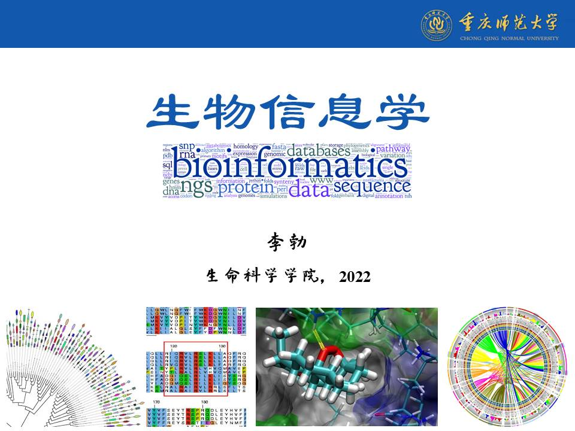

# CQNUBioinformatics - The Bioinformatics Course in CQNU

**CQNUBioinformatics**: Learning Bioinformatics Curriculum under the Guidance of *Dr*. Li

- Bo Li, *et al.*

 

This is the ***Cover Page*** of this course (drawn by *Dr*. Li)

**Course online**: please click [重庆师范大学生物信息学在线课程](http://www.ciblab.net/bioinformatics/). 

**Teaching Period Plan**: there are 36 class-hours for this curriculum, and the detailed information on time allocation is as follows: 

| No. | Content | Class-time on theory | Class-time on practice |
| :----: | :---- | :----: | :----: |
| 1 | Chapter-1. Introduction on Bioinformatics | 1 | 1 |
| 2 | Chapter-2. Database Resources in Bioinformatics | 2 | 4 |
| 3 | Chapter-3. Biological Sequence Alignment | 4 | 6 |
| 4 | Chapter-4. Biological Sequence Analysis | 3 | 3 |
| 5 | Chapter-5. Molecular Evolution Analysis | 4 | 6 |
| 6 | Chapter-6. Gene Expression Profiling | 2 | 6 |
| 7 | Chapter-7. Gene Set Annotation & Enrichment | 2 | 4 |
| 8 | Chapter-8. R Programming in Bioinformatics | 2 | 4 |

**Reminder**: If you have any questions, please do not hesitate to contact me (libcell@cqnu.edu.cn). 
